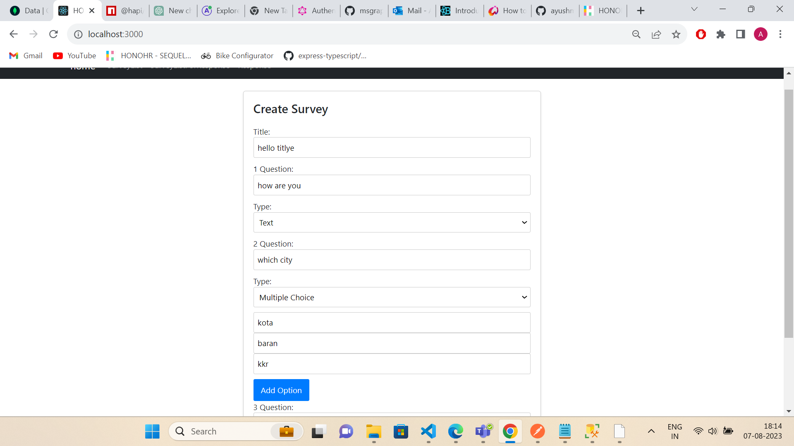
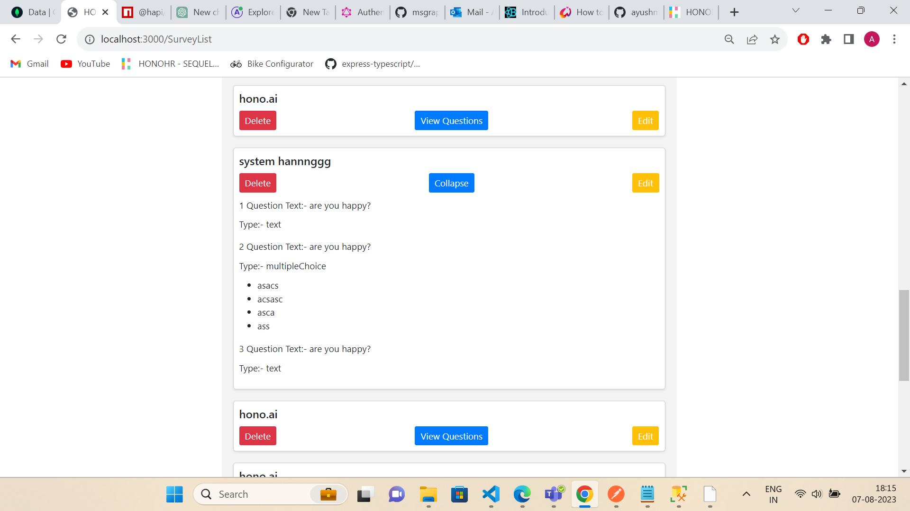
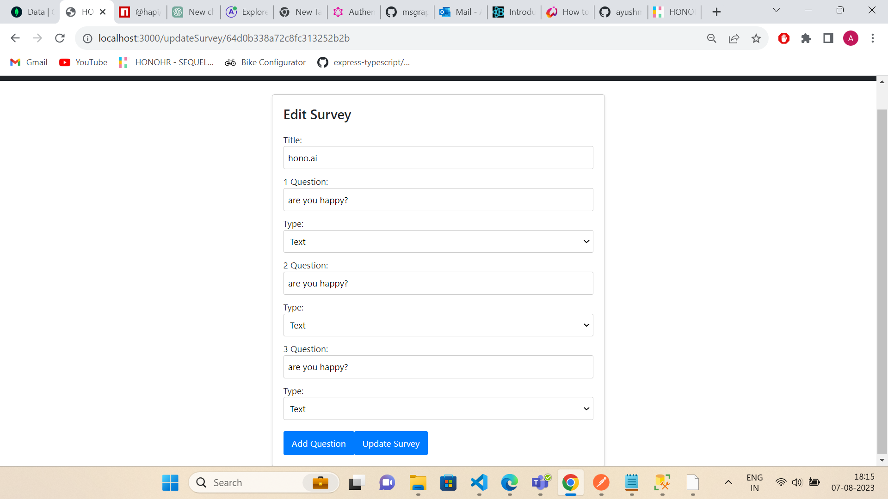
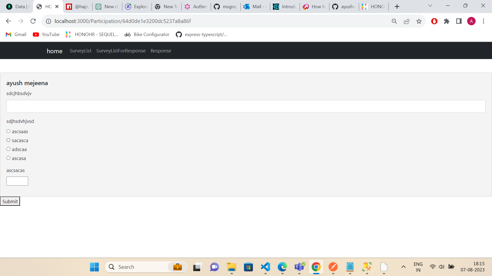
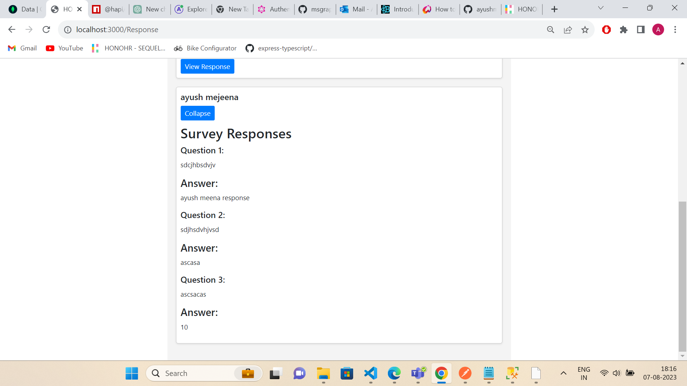

Certainly! Here's a template for a README file that explains how to use your survey application, including creating surveys, editing them, and responding to survey questions. Feel free to customize it according to your application's specific details.

---

# Survey Application

This is a Survey Application built using React.js for the frontend, Node.js for the backend, and MongoDB as the database.

## Table of Contents

- [Overview](#overview)
- [Getting Started](#getting-started)
  - [Prerequisites](#prerequisites)
  - [Installation](#installation)
- [Usage](#usage)
  - [Creating a Survey](#creating-a-survey)
  - [Editing a Survey](#editing-a-survey)
  - [Responding to Survey Questions](#responding-to-survey-questions)
- [Contributing](#contributing)
- [License](#license)

## Overview

The Survey Application allows you to create surveys, edit existing surveys, and respond to survey questions. The application utilizes React.js for the frontend user interface, Node.js for the backend server, and MongoDB to store survey data.

## Getting Started

### Prerequisites

Before you begin, ensure you have the following prerequisites installed:

- Node.js and npm (Node Package Manager)
- MongoDB database

### Installation

1. Clone the repository:

   ```sh
   git clone https://github.com/your-username/survey-application.git
   cd survey-application
   ```

2. Install frontend dependencies:

   ```sh
   cd frontend
   npm install
   ```

3. Install backend dependencies:

   ```sh
   cd ../backend
   npm install
   ```

## Usage

### Creating a Survey

1. Run the application:

   ```sh
   cd frontend
   npm start
   ```

2. Open your web browser and navigate to `http://localhost:3000`.

3. Click on the "Create Survey" button.

4. Fill in the survey title and add questions with options.

5. Click the "Submit" button to create the survey.

### Editing a Survey

1. Run the application as described in the "Creating a Survey" section.

2. On the survey list, click the "Edit" button next to the survey you want to edit.

3. Make the necessary changes to the survey title and questions.

4. Click the "Save" button to update the survey.

### Responding to Survey Questions

1. Run the application as described in the "Creating a Survey" section.

2. On the survey list, click the "View Questions" button next to the survey you want to respond to.

3. Provide your responses to the survey questions. For multiple-choice questions, select the appropriate option. For text or numeric questions, enter your response.

4. Click the "Submit" button to submit your responses.

screenshot





---

Feel free to enhance and customize this README template based on your project's unique features and requirements. Make sure to provide clear instructions for users to navigate and utilize your survey application effectively.